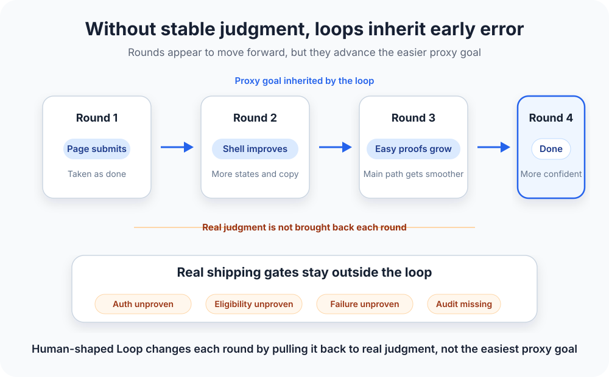

# Human-Shaped Loop: Injecting Human Judgment into Long Agent Tasks

[简体中文](./HUMAN-SHAPED-LOOP.zh-CN.md) | **English**

This article explains the engineering thinking and collaboration philosophy behind Loopora. For installation and usage, see [README](./README.md).

---

Loopora starts from a simple desire: laziness.

Not wanting to sit at the desk, wait for the Agent to finish a round, then point out what's wrong and nudge it to fix.

But it's not that simple—either you can't be lazy, or it doesn't work:

- **Run `/goal` and let the Agent keep going**: Pure blind box—you only know how far it drifted after it finishes. Tokens spent, result unpredictable, maybe you need to rerun everything from scratch.
- **Write a massive PRD and let it follow along**: The Agent quickly finishes the work and declares success—the larger the PRD, the more scattered the Agent's attention, the less reliable the final result. It always tends to close tasks fast rather than proving success item by item.

What if you don't take the lazy route? Watch every round, manually judge and correct—still not good enough: the Agent might fix A and forget B, patch B and lose C. Judgment gets scattered across rounds, lost between iterations. The same reminders get repeated over and over:
- "Beyond the UI, the backend logic needs to be complete"
- "Did you actually do permissions and audit?"
- "Tests only cover the main path, what about edge cases?"
- "Patch the failure path"
- "The code is bloated, needs a refactor"

Different failure patterns, same root cause: judgment has no stable position. The Agent can't see persistent standards, so output drifts, errors accumulate, the final delivery becomes unreliable.

Can we turn judgment into structure,施加固定的影响力 at a fixed position? Make long tasks run more steadily and healthily?

That's Human-shaped Loop—what Loopora is built to do.

  

## 1. A Task That Looks Perfect for an Agent

Imagine a B2B SaaS company whose support team handles many refund tickets daily. They decide to build a self-service refund flow: a customer admin opens the billing page, sees if an order is eligible, submits a refund request, and gets a clear result. If the order looks risky, the flow hands off to support.

This looks like a good task for a Coding Agent: UI to build, business rules to encode, tests to add, edge cases to discover, and enough work that one pass probably isn't enough.

The user requests:

> Build a self-service refund flow: customer admins can request refunds for eligible orders from the billing page; risky orders go to support. Make it safe, add tests, iterate until ready to ship.

Round one looks promising: page, form, status messages, mocked eligibility rules, passing main-path tests. The Agent replies:
> Refund flow fully implemented. All goals achieved.

For a demo, this looks complete. But for production release, can this feature ship?

**No.** Because:
- It didn't prove only authorized customer admins can request refunds—**permission boundary unverified**.
- Eligibility checks use mocked rules, not real business logic—**business logic stubbed**.
- Main-path tests pass, but partial refunds, disputed orders, chargebacks, past-window refunds, closed accounting periods aren't covered—**edge cases uncovered**.
- When the payment provider fails, how does the system record it, what's the ledger state, how does support take over—**failure path und designed**.
- Whether the audit log lets support, finance, or compliance reconstruct the whole process—**auditability unproven**.

The developer asks the Agent to patch these. Round two looks more product-like: more page states, fuller confirmation flow, some edge rules, summary mentions "authorization," "eligibility," "audit."

Progress, but problems remain: What did this round actually prove? Which risks were resolved versus merely mentioned? Where should the next round focus?

Another pattern emerges: across rounds, the Agent fixes A and forgets B, patches B and loses C, or drifts toward easier-to-report work—putting authorization in copy, keeping mocked rules, adding more main-path tests, then saying "security improved." It didn't completely drift, but core risks get hidden behind more product-like surfaces and smoother summaries.

The problem isn't that the Agent isn't diligent. The problem is that correct judgment has to be manually applied round by round to keep the task on track. Even a smarter model can't guarantee stable judgment across a large, long task. Errors accumulate, and the final result goes off course.

## 2. What Humans Keep Doing Is Only a Few Things

The previous section's problem can be reframed: long Agent tasks are naturally a loop—execute, report, judge, redirect, execute again.

In an Agent workflow, this loop's shape comes mainly from the Agent's current understanding, chat memory, and what it just did. Judgment standards have no fixed position—they're scattered across round-by-round reminders and corrections. Each human intervention temporarily reshapes the loop: reject what, trust what, block what, change what next, when to close.

Abstract these scattered actions, and humans repeatedly apply only a few control signals:

| Control Signal | Meaning | Typical Case |
| --- | --- | --- |
| Completion veto | "Looks done, but doesn't meet delivery standard" | "This is just demo, backend needs to be complete" |
| Evidence ruling | "This material is trustworthy, that is just self-report" | "Tests pass, but edge cases?" |
| Execution steering | "Next round don't expand, patch the key gap first" | "Patch failure path first, don't keep polishing UI" |
| Blocking constraint | "This risk can't be packaged as completion" | "Permissions not proven, can't close" |
| Closure ruling | "What's proven, what's explicit residual risk" | "This risk can carry forward, but someone must own it" |

Five control signals, different concrete contents per task, but same abstract shape: pull the Agent from "looks done" back to "actually delivered."

既然形态稳定，关键问题就来了: can these control signals be extracted before the task starts,变成后续轮次会自动继承的结构?

That's the core idea of Human-shaped Loop.

## 3. Human-shaped Loop Definition

**Human-shaped Loop turns human judgment into execution structure that shapes subsequent loops.**

This structure determines:
- What results will be accepted
- What evidence is sufficient
- What risks must be blocked
- Based on current evidence, how the next round turns
- How the task honestly closes

It's not writing more requirements upfront—that's a longer PRD. It's not making the model reflect more rounds—that's stronger self-checking. It's not替人类做判断—that脱离人的 control.

It solves something else: make human judgment unavoidable material for subsequent work, instead of needing humans to keep emphasizing.

So Human-shaped Loop doesn't关注"will the model work harder"—it关注"can human judgment be previewed, executed, evidenced, traced, and ruled upon."

## 4. Why PRD, Tests, and Plain Loops Aren't Enough

The previous section naturally raises a question: if we write a finer PRD and design fuller tests upfront, can the Agent just follow along?

当然应该这样做. Upfront clarification, detailed PRD, complete test plan—all significantly improve round-one quality.

But they improve opening quality, not judgment callbacks during execution.

In the real world, even the strongest engineering team can't foresee all problems upfront. Design docs state intent; execution generates new facts. Once multi-round execution begins, each round raises new questions:
- What code and flow did it actually change?
- Which hard parts did it绕过?
- Are new tests proving core risks, or只是证明更容易通过的路径?
- Did the summary把"尚未证明"写成"已经完成"?

These questions only appear after execution, can't be exhausted at design stage.

PRD or prompt answers "what to do." Human-shaped Loop answers "is it proven, should it turn, can it close." Different layers.

| PRD / prompt | Human-shaped Loop |
| --- | --- |
| Describes goals and constraints known before task starts | Turns judgment into control structure that keeps acting during execution |
| Reminds Agent what to care about | Requires each round to respond with evidence |
| Improves round-one quality | Controls error propagation across rounds |
| May be selectively quoted or locally satisfied | Records gaps, blockers, and residual risk |
| Only guidance, no hard constraint | No proof means no closure |

Judgments that can be written as tests, type checks, lint, proof scripts—当然应该优先写. These are hard evidence, machine-adjudicable.

But some judgments can't be externalized or quantified as a concrete metric. For example:
- "Code is bloated, needs a refactor"—this is complexity perception, not testable.
- "This方案滑向更容易汇报的工作, not touching真正难点"—this is execution-direction judgment, needs human ruling.
- "This risk可以随行, but must be visible and owned"—this is residual-risk strategy, depends on team commitments and business environment.

These judgments need to become structure, constraining subsequent action and final evaluation.

  

## 5. Why Not Just Use Fixed Team Templates

A popular approach in open-source: mold Agent workflows after human engineering teams—PM Agent analyzes requirements, Architect Agent designs, Engineer Agent implements, QA Agent reviews, Reviewer Agent signs off.

This approach has value, but it's a特定形态的 Loop—fixed team template. It fits scenarios where task type, failure mode, and deliverables are all stable. For other scenarios:

- **Light tasks**: Fix button copy,拆一个小函数—套上PM、Architect、QA流程只会 overkill, slows work.
- **Heavy tasks**: Refund flow, data migration—fixed role names can't自动知道这次任务最怕哪种伪完成. "QA"可能只检查页面可用、测试通过、文案完整, yet misses authorization path, refund eligibility, audit trail.

Fixed team template的本质: presets一套角色分工和交接顺序. It answers "who first, who next, who reviews whom." But it doesn't answer:
- What's the completion standard for this task?
- What evidence counts as sufficient?
- Which gap should pull the next round?
- When can the task honestly close?

These answers change with the task. Fixed templates can't adapt.

Loopora differs: before running, dynamically generate Loop structure per current task—extract completion standards, fake-done patterns, evidence requirements, blocking risks, execution priorities, residual-risk policies, compile into一份可审查的方案. Human confirms, then the Loop executes stably—后续轮次不能偷偷降低标准.

Dynamic generation不等于运行时随意改规则. It's compile once before run, stay stable during execution. When judgment needs change, return to `/loopora-plan` or Web review to realign,而不是让执行阶段偷偷改方案.

One-sentence summary:
> Fixed team templates are one specific form of Loopora, suited for stable tasks with预设判断. Loopora's full capability: dynamically generate judgment structure per task—light tasks get light process, heavy tasks get heavy evidence.

## 6. How This Lands in Loopora

Loopora's core workflow: **compile human judgment into runnable Loop structure, let the Agent execute within it, each round's result returns to evidence buckets, gaps pull the next round.**

具体来说:

**Before run: Compile judgment**
- Human describes task and key judgments via `/loopora-plan` or Web
- Loopora extracts completion standards, fake-done patterns, evidence requirements, blocking risks, residual-risk policies
- Compiles into一份可审查的 Loop plan
- Human confirms, Loop stays stable—后续轮次不能偷偷降低标准

**During execution: Evidence-driven**
- Agent executes within Loop structure
- Each round's result gets整理成证据桶: proven, weak evidence, unproven, blocking risk
- Evidence gaps automatically pull the next round's execution direction

**At closure: Honest ruling**
- Results clearly separate: what's proven, what scenarios uncovered, what problems block closure
- Residual risks visible, named, owned
- System can finish running while task may remain unproven—二者分开

  

Back to the refund task. Before run, Loopora turns judgment into runnable structure:
- Page submission is not completion
- Authorization, eligibility, payment failure, audit, support handoff must have evidence
- Unauthorized refunds, double refunds, missing audit trails must block
- Rare payment-provider edges can be residual risk, but must be visible, named, owned

After round one, the Agent can't just report "I finished." It must return to明确判断标准:
- What did this round prove?
- Evidence for authorized-admin path?
- Is refund eligibility real business path or still mocked?
- After payment failure, is there record, ledger state, support handoff?
- Can audit material let support, finance, compliance reconstruct afterward?

Results get整理成证据桶:

| Evidence Bucket | This Round's Reality |
| --- | --- |
| Proven | Page can submit, main-path tests pass |
| Weak evidence | Refund eligibility still mainly from mocked rules |
| Unproven | Authorized-admin path, payment failure handling, audit trail |
| Blocking risk | Unauthorized refund path not proven safe, can't close |

Evidence buckets and control signals are一体两面: control signals是人施加的判断动作, evidence buckets是这些动作落在每轮结果上的分类. Human applies "evidence ruling," result lands in "proven" or "weak evidence"; human applies "blocking constraint," result shows "blocking risk."

  

When evidence is insufficient, the next round doesn't freely explore—it gets pulled back to key gaps: authorization proof, refund eligibility boundaries, payment failure path, audit records, human handoff.

At closure, we don't追求零风险—we clearly separate: what's proven, what scenarios uncovered, what blocks closure, what risks can carry forward but must be visible and owned.

## 7. What Tasks Fit Loopora

Loopora doesn't fit every complex task. Complexity isn't the deciding factor—the real factor is whether this judgment needs repeated execution.

Engineering流程有成本. Fixing button copy doesn't need design review, release gates, retrospectives; fixing a clear-stacktrace bug usually doesn't either. Heavy流程套在轻任务上只会拖慢工作.

But refunds, billing permissions, payment callbacks, data migrations are different. Risk accumulates across rounds, evidence needs retention, completion can't rely only on the implementer's self-report. Design must clarify risks, tests must prove key boundaries, pre-release needs human ruling, failure paths must be traceable.

判断顺序如下:

| Gate | If leaning "yes" | If leaning "no" |
| --- | --- | --- |
| Is one Agent pass plus one human review enough? | No need for Loopora,直接做更划算 | Keep judging |
| Will subsequent rounds generate new evidence? | Keep judging | No need for Loop, just拉长叙事 |
| Can the judgment稳定变成自动检查? | Prefer tests, benchmarks, proof scripts | Keep judging |
| Is there fake completion risk? | Loopora更值得 | Simple loop or direct Agent可能就够了 |
| Does this judgment need to超出单次对话? | Worth compiling into Loop | Just chat |

具体例子:
- **Usually not needed**: Generate 30 campaign themes, fix button error with clear stacktrace,拆边界明确的小函数
- **Better fit**: Self-service refunds, billing permission refactor, cross-service payment callback loss, brand exploration needing multi-round discovery but avoiding stale patterns

关键差别不是任务听起来复杂,而是人类是否会在关键轮次后反复回来判断证据、风险、方向和收尾.

## 8. Can Stronger Models Solve the Judgment Problem?

Models should learn general capabilities: language, code, planning, tool use, reasoning patterns, broad aesthetics. These should transfer across users and tasks.

Stronger models of course make many things simpler—like更资深的工程师, can spot更多风险 upfront, write better first-plan, make fewer basic mistakes.

But nobody cancels code review, tests, release gates, audit trails, incident retrospectives just because the engineer is资深. This isn't distrust of individual ability—交付判断本来就不只存在于个人能力里. Which risks are acceptable, what evidence counts as sufficient, when residual risk can ship—all depend on具体任务、团队承诺、业务环境, must be explicitly exposed for debate and modification.

That's why judgment in one task should usually be treated as local, temporary, debatable:

- This refund flow must be conservative, doesn't mean every product task must be.
- This prototype can accept rough visuals, doesn't mean all prototypes can.
- This benchmark is credible, doesn't mean all benchmarks are.
- Accepting this residual risk now, doesn't mean it's a long-term preference.

These judgments should be explicit, previewable, editable, exportable, disposable. They fit better in the Loop layer outside the Agent, not silently baked into model weights or long-term memory.

> Models learn general capability. Loops learn how this task should be judged.

## 9. Conclusion: Laziness Comes from Trusted Autonomy

Future AI-human collaboration won't evolve only along the "smarter models" line.

Models will keep getting stronger, but complex tasks still need human judgment: what's worth doing, what counts as real completion, is evidence credible, is risk acceptable, when to continue, stop, or pivot.

This philosophy didn't spring from abstract AI theory. It更像是在学习人类工程管理中那些经验证明有用的东西: reviews, gates, evidence, traces, retrospectives, and天然不信任 of "looks done." Loopora doesn't copy organizational流程—it compresses这些约束 into Agent-executable task structure.

真正的高阶协作,不是每一步都把人拉回,也不是假装人可以完全离开,而是让人类判断力以更合适的时间形态参与任务.

Human-in-the-loop puts humans inside execution.

Human-shaped Loop turns human judgment into prior execution structure.

Loopora wants to raise not Agent freedom, but trusted autonomy. Autonomy isn't running without constraint—it's continuing within human judgment structure.

When judgment, evidence, redirect, and closure are all externalized, humans can truly intervene less often. That's Loopora's version of laziness: not sacrificing quality to save effort, but raising trusted autonomy so the same judgment doesn't have to be repeated by hand.

This is Human-shaped Loop.

For installation and running Loopora, return to [README](./README.md). README explains how to use; this article explains why this layer exists.