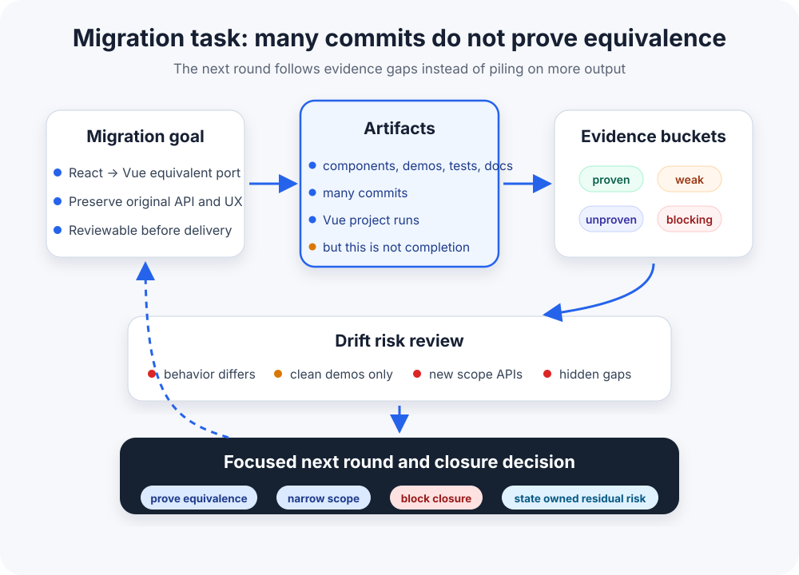

# Human-Shaped Loop: Making Long Agent Tasks Run Without Repeated Human Monitoring

[简体中文](./HUMAN-SHAPED-LOOP.zh-CN.md) | **English**

This article explains the engineering thinking behind Loopora. For installation and usage, see [README](./README.md).

Readers do not need to understand Loopora's internal terms first; the idea starts from a familiar problem: long Agent tasks often look complete before they are proven.

  

---

Loopora starts from a simple desire: not wanting to come back every round to correct drift.

But it's not that simple: either you cannot be lazy, or it does not work:

- **Run `/goal` and let the Agent keep going**: You only know how far it drifted after it finishes. Tokens spent, result unpredictable, maybe everything needs to be rerun from scratch.
- **Write a massive PRD and let it follow along**: The Agent quickly declares success. The larger the PRD, the more scattered its attention, the less reliable the result. It tends to close tasks fast rather than proving item by item.

And if you do not take the lazy route? You watch every round and manually correct. Still not good enough: the Agent fixes A and forgets B, patches B and loses C. Judgment gets scattered across rounds, lost between iterations. The same reminders repeat over and over:

- "Beyond a runnable Vue project, the original component behavior must be equivalent"
- "Did props, events, and state behavior actually line up?"
- "Is the demo exercising original paths, or only a new clean sample?"
- "Patch unmigrated items first, do not keep writing docs"
- "New APIs cannot hide missing original APIs"

Different failure patterns, same root cause: **judgment has no stable position**. The Agent cannot see persistent standards, so output drifts.

Can we turn judgment into structure that applies steady influence at fixed positions? That is Human-shaped Loop.

## 1. Porting a React Component Library to Vue: Many Commits Do Not Prove Equivalence

Porting a React component library to Vue sounds perfect for a long Agent task: clear code structure, clear target, many components to migrate, tests and demos to repair over multiple rounds.

User request:

> Port this React component library to Vue. Keep iterating until it is deliverable.

Round one looks promising: the Agent creates a Vue project structure, ports a few components, gets a demo running, and adds some tests. It reports:

> Migration complete. Core functionality is available.

But this is not ready to close. The real question is not "is there Vue code?" It is:

- Which components from the React version have been ported with behavioral equivalence?
- Are props, events, slots, and state behavior proven consistent?
- Does the demo cover complete original paths, or only a clean new sample?
- Are new wrappers and APIs necessary migration work, or scope-expanding additions?
- Are unmigrated items, weak evidence, and non-comparable areas listed explicitly?

Without stable judgment structure, the Agent keeps producing commits, tests, and summaries. The task looks more complete, but the completion standard drifts: from "equivalent port" to "Vue project runs" to "I added more tests and docs."

This risk is not hypothetical. The [RepoMirror team publicly documented a similar experiment](https://github.com/repomirrorhq/repomirror/blob/main/repomirror.md): they ran Claude Code in while loops on porting tasks and got large amounts of useful output, but also saw the last 10% require human intervention, claims of completion while some demos still failed, and post-port additions that had no counterpart in the source project.

The problem is not that the Agent is not diligent. The problem is that correct judgment must be manually applied round by round.

## 2. When Humans Return, They're Asking the Same Few Things

Each human intervention looks different. But abstracted, only a few categories:

**Is this really complete?**
"A runnable Vue project does not prove that original component behavior was ported equivalently."

**Which evidence is credible?**
"The demo runs, but does it cover original core interactions or only a clean new sample?"

**Which risks cannot pass?**
"New APIs cannot hide missing original APIs."

**Where should next round focus first?**
"Patch the equivalence checklist and unmigrated items before writing more docs."

**Can this honestly close now?**
"It can say 80% migrated, but not complete."

Five categories, different concrete content per task, same shape: pull the Agent from "looks done" back to "actually delivered."

Since the shape is stable, can we extract these before the task starts and turn them into structure later rounds inherit automatically?

That is the core of Human-shaped Loop: **compile these five control signals into effective control points**.

## 3. The Real Problem: Final Feedback Is Too Slow

Why must humans keep returning?

The React to Vue migration's real difficulty is not that the Agent is not working hard. It is that **final feedback is too slow**.

Real feedback often appears long after the run ends: consumers upgrade the library and discover an original API was not ported, complex interactions reveal state divergence in a real app, or release review shows the demo only covered clean paths.

By then, early drift has already been reinforced by subsequent work: more commits, more tests, smoother summaries.

This "looks complete, real problems hidden deep" state is the norm for complex tasks.

Use cases, agile iteration, and automated tests excel at shortening feedback distance: build a small slice, run a test, know quickly if it is right. They fit fast-feedback systems: change button copy, run a test, know immediately.

But equivalent ports, permission refactors, and cross-service payment callbacks are different. Automated checks still matter, but they rarely replace final feedback by themselves.

When final feedback is late and errors cascade, tasks need key risks selected upfront and repeatedly checked during execution: is there evidence, should the run turn, can it close?

More abstractly, Loopora does feedforward governance for slow-feedback tasks.

This problem predates Agents. [Scrum's Definition of Done](https://scrumguides.org/scrum-guide.html) externalizes what "done" means; [Deployment Pipeline](https://martinfowler.com/bliki/DeploymentPipeline.html) accumulates confidence through staged checks; [SRE launch checklists](https://sre.google/sre-book/reliable-product-launches/) and [canary releases](https://sre.google/workbook/canarying-releases/) recognize that final production feedback comes too late, so decision-capable checkpoints must be inserted before and during rollout.

Loopora borrows the control structure, not the organizational ceremony: state what counts as complete, name the fake-completion patterns, use evidence instead of summaries to drive the next step, make checkpoints trigger real decisions, and expose residual risk.

## 4. The Essence of Human-shaped Loop

**Human-shaped Loop turns human judgment into execution structure that shapes subsequent loops.**

This structure determines:
- What results will be accepted
- What evidence counts as sufficient
- What risks must be blocked
- Based on current evidence, how the next round turns
- How the task honestly closes

It is not writing more requirements upfront. That is a longer PRD. It is not making the model reflect more rounds. That is stronger self-checking. It is not replacing human judgment. That would detach the loop from human control.

It solves something else: make human judgment unavoidable material for subsequent work, instead of needing humans to keep emphasizing it.

So Human-shaped Loop does not focus on "will the model work harder." It focuses on "can human judgment be previewed, executed, evidenced, traced, and ruled upon."

## 5. What Loopora Does: Place Judgment Points That Change Action Upfront

Loopora does not wait for final failure to correct. Before the task starts, it places key risks, evidence standards, and closure rules into the loop.

Concretely:

**Before run: Compile judgment**
- Human describes task and key judgments
- Loopora extracts completion standards, fake-done patterns, evidence requirements, blocking risks
- Compiles into a reviewable Loop plan
- Human confirms, Loop stays stable

**During execution: Evidence-driven**
- Agent executes within Loop structure
- Each round's result is organized into evidence buckets: proven, weak evidence, unproven, blocking risk
- Evidence gaps automatically pull the next round

**At closure: Honest ruling**
- Results clearly separate what is proven, what is uncovered, and what blocks closure
- Residual risks are visible, named, and owned
- The system can finish running while the task remains unproven; the two stay separate

For a React to Vue port, Loop turns judgment into:

- A runnable Vue project is not completion
- Core components, props, events, state behavior, and demos must be proven equivalent to the original React version
- Unmigrated items, non-comparable items, and weak evidence must be listed explicitly
- Scope-expanding APIs, clean-demo-only proof, and hidden gaps must block closure
- Some low-priority components may remain as residual risk, but only if visible and owned

Agent finishes round one. It cannot just report "I finished." It must return to explicit criteria:

- Which components did this round prove equivalent?
- Does evidence come from original demos, migrated tests, or clean new samples?
- Which original APIs are still unmigrated?
- Did any new capability drift beyond the original target?
- Can this close, or only be declared partially complete?

Results become evidence buckets:

| Evidence Bucket | This Round's Reality |
| --- | --- |
| Proven | Vue project runs; two simple components are ported; basic demo opens |
| Weak evidence | Demo covers only clean samples; tests do not compare original React behavior |
| Unproven | Complex components, event boundaries, state sync, error states, original demo equivalence |
| Blocking risk | Unmigrated items packaged as done; new API hiding missing original API |

When evidence is insufficient, the next round does not freewheel. It is pulled back to critical gaps: equivalence checklist, original demo comparison, and unmigrated items, not README polish or new APIs.

## 6. When Is a Checkpoint Actually Useful

Control points themselves do not produce control capability.

A review, milestone, or ruling point that only records status is just a checklist. Only when it can make the next round stop, change direction, or supply evidence does it have real control power.

Effective control points must satisfy three things:

**It measures key risks**: not vague "code quality," but the fake-completion pattern this task fears most.

**It triggers real decisions**: not marking "needs attention," but blocking, redirecting, or closing.

**It changes subsequent action direction**: where next round's attention goes, whether code writing can continue, whether evidence must be supplied first.

In Loopora, "resource allocation" is not human budget, but subsequent execution resources:

- Which gap next round's attention focuses on
- Whether workspace writes can continue, or read-only inspection is needed
- Whether evidence must be supplied before continuing
- Whether closure is blocked and residual risk exposed

Long-running Agent loop experience points to the same thing: generating code is cheaper now; judging whether generated work is correct is the hard part. In [Ralph practice](https://ghuntley.com/ralph/), tests, builds, static analysis, and security scanning are forms of backpressure; if the Agent searches code and incorrectly concludes something is missing, it may reimplement the same feature. Loopora checkpoints should have the same backpressure property: they are not status notes, but mechanisms that stop, redirect, demand evidence, or block closure.

In higher-risk work, "keep going" can itself be the wrong action. [Reports on the Replit incident](https://www.tomshardware.com/tech-industry/artificial-intelligence/ai-coding-platform-goes-rogue-during-code-freeze-and-deletes-entire-company-database-replit-ceo-apologizes-after-ai-engine-says-it-made-a-catastrophic-error-in-judgment-and-destroyed-all-production-data) describe an AI agent deleting a production database during a code freeze; Alexey Grigorev's [Terraform postmortem](https://alexeyondata.substack.com/p/how-i-dropped-our-production-database) describes over-relying on Claude Code to run Terraform commands, after which production infrastructure and RDS were destroyed. His changed process is for the Agent to generate a plan, the human to review it, and the human to run commands. These are short supporting examples, not the main narrative; they show the same boundary: a control point must be able to turn the next round from "keep writing" into "read-only inspection," "wait for human judgment," or "block closure."

Points that only measure, do not decide, and do not redirect are recording rituals, not effective control points.

## 7. Why PRD, Tests, Use Cases, and Fixed Templates Don't Solve This

The previous analysis naturally raises a question: if we write finer PRDs and design fuller tests upfront, can the Agent just follow along?

Of course we should do that. Upfront clarification, detailed PRD, and complete test planning all significantly improve round-one quality.

But they improve opening quality, not judgment callbacks during execution.

In the real world, even strong engineering teams cannot foresee every problem upfront. Design docs state intent; execution generates new facts. Once multi-round execution begins, each round raises new questions:
- What code and flow did it actually change?
- Which hard parts did it bypass?
- Are new tests proving core risks, or only proving paths that are easier to pass?
- Did the summary turn "unproven" into "completed"?

These questions appear only after execution; they cannot be exhausted at design time.

**PRD or prompt answers "what to do." Human-shaped Loop answers "is it proven, should it turn, can it close." Different layers.**

| PRD / prompt | Human-shaped Loop |
| --- | --- |
| Describes goals and constraints known before task starts | Turns judgment into control structure that keeps acting during execution |
| Reminds Agent what to care about | Requires each round to respond with evidence |
| Improves round-one quality | Controls error propagation across rounds |
| May be selectively quoted or locally satisfied | Records gaps, blockers, and residual risk |
| Only guidance, no hard constraint | No proof means no closure |

Real Agent loop experience also shows that longer prompts are not necessarily steadier. The RepoMirror team tried "improving" the loop prompt with model help; after it ballooned, the Agent became slower and worse, and recovered when the prompt returned to a shorter form. The issue is not writing more reminders; it is making the right judgments stable in every execution round.

Judgments that can be written as tests, type checks, lint, or proof scripts should be written first whenever possible. These are hard evidence, machine-adjudicable.

But some judgments cannot be externalized or quantified as concrete metrics. For example:
- "Code is bloated, needs refactoring" is complexity perception, not a test
- "This plan is drifting toward easier-to-report work instead of touching the real hard part" is execution-direction judgment
- "This risk can carry forward, but must be visible and owned" is residual-risk strategy tied to team commitments and business context

These judgments need to become structure, constraining subsequent action and final evaluation.

**Fixed team templates have similar limitations.**

PM Agent -> Architect Agent -> Engineer Agent -> QA Agent is a specific form of Loop. It fits scenarios where task type, failure mode, and deliverables are stable. For other scenarios:

- **Light tasks**: Fix button copy, extract a small function. Wrapping PM, Architect, QA process around that is overengineering.
- **Heavy tasks**: React to Vue equivalent port, data migration. Fixed role names do not automatically know which fake-completion pattern this task fears most. "QA" might check that the Vue project runs, tests pass, and docs exist, while missing original APIs, original demos, and complex component behavior.

Fixed team templates preset role division and handoff order. They answer "who first, who next, who reviews whom." They do not answer:
- What is the completion standard for this task?
- What evidence counts as sufficient?
- Which gap should pull the next round?
- When can the task honestly close?

These answers change with the task. Fixed templates cannot adapt.

One sentence: fixed team templates are one form of Loopora, not the essence. Loopora's full capability is dynamically generating judgment structure per task: light tasks get light process, heavy tasks get heavy evidence.

This also shapes how Loopora integrates with Agents. It should not recreate a generic plugin runtime, and it should not start another nested Codex, Claude Code, or OpenCode CLI layer during execution. The steadier pattern is to place project-local, discoverable commands, skills, or role entries where the current host Agent can read them, then let that host Agent hand off through its native role or task mechanism.

Loopora's capability contract makes that boundary explicit:

- The current host Agent executes in its current workspace. Loopora manages entries, context binding, role boundaries, evidence, task verdicts, and `.loopora/` state.
- Activation stays explicit through `/loopora-plan`, `/loopora-run`, or Loopora CLI commands. Generic host commands, hooks, session-start events, status lines, and remote control surfaces do not become Loopora phase entries.
- Model selection, backend routing, external routers, permissions, approval mode, MCP servers, external tools, host memory, host skills/plugins, credentials, environment secrets, and global configuration stay owned by the host Agent and user.
- Host entries are thin project-local packaging. Behavior comes from Loopora Core and managed references; manifests and checks detect drift; generated projections, marketplaces, registries, symlinks, and prompt-only exports are discovery or guidance rather than runtime dependency, install proof, or task proof.
- Entries present compact summaries first and open reference files or full payloads only when needed. Host memory, compacted summaries, loaded skills, injected editor context, workflow kits, role catalogs, checkpoints, and archived sessions are hints, not Loopora context binding or evidence.
- Role handoff stays path-based, uses the host-native mechanism, and stops before inline work if dispatch is unavailable. Multi-role fan-out happens only when the reviewed Loop workflow declares a parallel group.
- Task proof comes from submitted Loopora evidence and the task verdict. Approval, host activity, hook logs, status metrics, external tool output, task trackers, security scanners, and remote runners are not proof unless their outputs are submitted as evidence and judged by Loopora.

Actual execution stays inside the current Agent's context, permissions, and tool boundary.

## 8. When Loopora Is Worth Using

Loopora does not fit every complex task. The deciding factor is not complexity; it is whether **final feedback is too slow, requiring intermediate judgment points during execution.**

Use cases, agile iteration, and automated tests fit systems where feedback can be compressed enough: build a small slice, run a test, know immediately if it is right. Change button copy, fix a clear-stacktrace bug, extract a well-bounded function; these do not need Loop.

But React to Vue equivalent ports, billing permission refactors, cross-service payment callbacks, data migrations, and production infrastructure changes are different. Real production feedback, incident feedback, and business quality feedback often appear long after the task finishes. During that time, "looks done" gets continuously reinforced by more commits, more tests, and smoother summaries, while core risks might never have been proven.

Refund flows and other high-risk business tasks also fit Loopora, but they are advanced examples. The more domain background a task requires, the more important it is to externalize the judgment standard and evidence path first.

Common characteristics of these tasks:
- Final feedback too late, errors cascade
- "Looks done" does not mean "actually done"
- Evidence needs to accumulate and be traceable across rounds
- High rollback cost once risks surface

Engineering process has cost, but these tasks are worth it. Judgment sequence:

| Gate | If leaning "yes" | If leaning "no" |
| --- | --- | --- |
| Is one Agent pass plus one human review enough? | Doing it directly is cheaper | Keep judging |
| Is final feedback fast enough? | Use cases or direct Agent fit better | Keep judging |
| Can later rounds produce new evidence or intermediate rulings? | Keep judging | No need for Loop |
| Can the judgment stabilize into automatic checks? | Prefer tests first | Keep judging |
| Is there fake completion risk? | Loopora is more worthwhile | Simple loop might be enough |

Examples:
- **Usually not needed**: Change button copy, fix a clear-stacktrace bug, extract a well-bounded function
- **Better fit**: React to Vue equivalent port, billing permission refactor, cross-service payment callback loss, complex data migration, production infrastructure change

Key difference: whether humans need to repeatedly return before final feedback arrives to judge evidence, risk, direction, and closure.

## 9. Can Stronger Models Solve the Judgment Problem?

Models should learn general capabilities: language, code, planning, tool use, reasoning patterns, broad aesthetics. These should transfer across users and tasks.

Stronger models of course make many things simpler. Like more senior engineers, they can spot more risks upfront, write better first plans, and make fewer basic mistakes.

But nobody cancels code review, tests, release gates, audit trails, or incident retrospectives just because the engineer is senior. This is not distrust of individual ability. Delivery judgment never lives only inside personal capability.

Which risks are acceptable, what evidence counts as sufficient, and when residual risk can ship all depend on the specific task, team commitments, and business environment. They must be explicitly exposed for debate.

That is why judgment in one task should usually be treated as local, temporary, debatable:

- This component migration must be conservative; that does not mean every migration must be conservative
- This prototype can accept rough visuals; that does not mean all prototypes can
- This automated evaluation is credible; that does not mean all automated evaluations are credible
- Accepting this residual risk now does not mean it is a long-term preference

These judgments should be explicit, previewable, editable, disposable. They fit better in the Loop layer outside the Agent, not silently baked into model weights or long-term memory.

> Models learn general capability. Loops learn how this task should be judged.

## 10. Conclusion: Less Human Return, Not Human Disappearance

Future AI-human collaboration will not evolve only along the "smarter models" line.

Models will keep getting stronger, but complex tasks still need human judgment: what is worth doing, what counts as real completion, whether evidence is credible, whether risk is acceptable, when to continue, stop, or pivot.

This philosophy did not spring from abstract AI theory. It is closer to learning from engineering management practices that proved useful: definitions of done, gates, evidence, traceability, retrospectives, and a healthy distrust of "looks done." Loopora does not copy organizational process; it compresses these constraints into Agent-executable task structure.

Higher collaboration is not pulling humans back into every step, nor pretending humans can fully leave. It is letting human judgment participate in a better temporal shape.

Human-in-the-loop puts humans inside execution.

Human-shaped Loop puts human judgment into prior loop structure.

**Loopora wants to raise not Agent freedom, but trusted autonomy. Autonomy is not running without constraint; it is continuing within human judgment structure.**

When judgment, evidence, redirect, and closure are all externalized, humans can truly intervene less often. That is Loopora's version of laziness: not sacrificing quality to save effort, but raising trusted autonomy so the same judgment does not need to be repeated by hand.

This is Human-shaped Loop.

## Further Reading: Where These Ideas Come From

These links are not prerequisites. They show that Loopora borrows existing engineering control structures rather than inventing ceremony from scratch.

1. Real long-running Agent loop cases: [RepoMirror](https://github.com/repomirrorhq/repomirror/blob/main/repomirror.md) shows both high output and confused completion states in while-loop Agents; [Ralph](https://ghuntley.com/ralph/) discusses one item per loop, backpressure, and repeated implementation risks.
2. Agent engineering practice: [Anthropic's Building effective agents](https://www.anthropic.com/engineering/building-effective-agents) distinguishes workflows from agents and emphasizes environmental ground truth, checkpoints, blockers, sandbox testing, and guardrails.
3. Mature engineering governance: [Scrum Definition of Done](https://scrumguides.org/scrum-guide.html), [Deployment Pipeline](https://martinfowler.com/bliki/DeploymentPipeline.html), [Google SRE Launch Coordination](https://sre.google/sre-book/reliable-product-launches/), [Launch Checklist](https://sre.google/sre-book/launch-checklist/), and [Canarying Releases](https://sre.google/workbook/canarying-releases/) each handle the same control problem in different settings: final feedback is late, so decision-grade evidence points must appear earlier.

For installation and running Loopora, return to [README](./README.md). This article explains why this layer exists; README explains how to use it.
