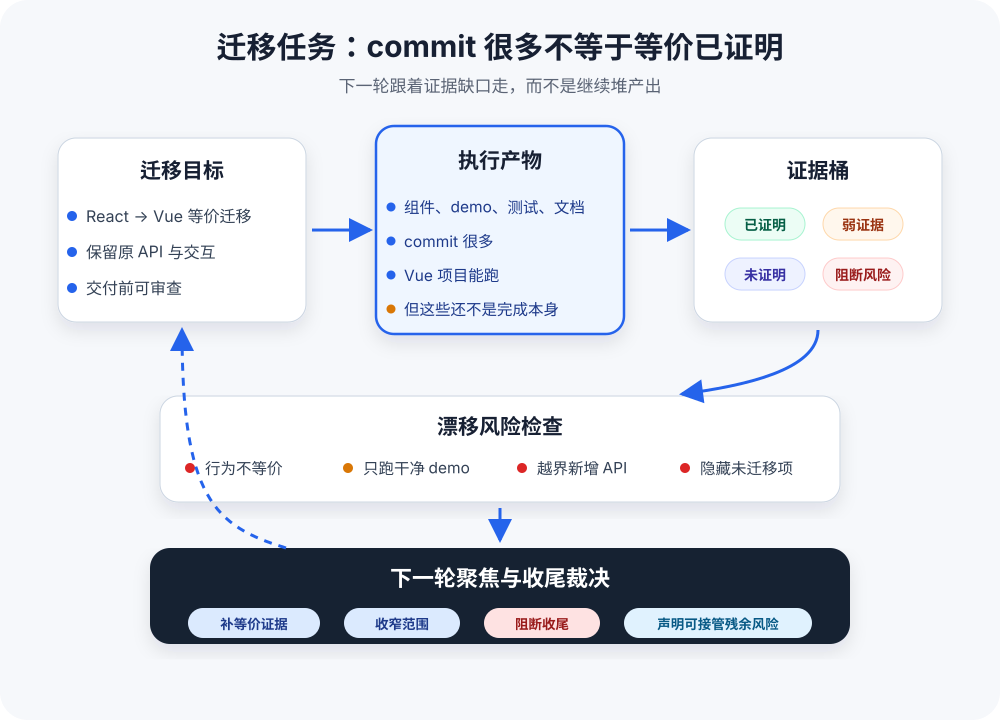

# Human-Shaped Loop：让长期 Agent 任务不靠人反复盯

**简体中文** | [English](./HUMAN-SHAPED-LOOP.md)

本文阐述 Loopora 背后的工程思考。想安装和运行，请参见 [README](./README.zh-CN.md)。

读者不需要先理解 Loopora 的内部名词；它先从一个常见问题说起：长期 Agent 任务经常先看起来完成，再被证明并没有完成。

  

---

Loopora 的出发点很朴素：不想每轮都回来纠偏。

但事情没那么简单——要么偷不了懒，要么不靠谱：

- **开个 `/goal` 让 Agent 持续跑**：跑完才知道偏了多远。Token 花了，结果不可预测，也许要全部重来。
- **写一份超大 PRD 让它照着干**：Agent 很快宣告成功——PRD 越大，注意力越分散，结果越不可靠。它倾向于快速关闭任务，而不是逐条证明。

那不偷懒呢？人每轮都手工纠偏——效果还是不够好：Agent 做 A 忘 B，补 B 丢 C。判断散落在每轮提醒里，流失在轮次之间。同一类话一轮轮被重复说出：

- "除了 Vue 项目能跑，原组件行为也要等价"
- "props、事件和状态到底对齐了吗"
- "demo 跑的是原项目路径，还是新写的干净样例"
- "先补未迁移项，不要继续写文档"
- "新增 API 不能掩盖原 API 没迁移"

这些失败模式不同，根因一样：**判断标准没有稳定位置**。Agent 看不到持久标准，产出就会漂移。

能不能把判断变成结构，在固定位置施加固定影响力？这就是 Human-shaped Loop。

## 1. 为什么 Agent 长任务容易"看起来完成"

把一个 React 组件库迁移到 Vue，听起来很适合长期 Agent 任务：代码结构清楚，目标明确，可以一轮轮迁移组件、补测试、修 demo。

用户提出需求：

> 把这个 React 组件库迁移成 Vue 版本。持续迭代，直到可以交付。

第一轮结果看起来不错：Agent 建好了 Vue 项目结构，迁移了几个组件，demo 能跑，测试也有一些。它汇报：

> 迁移已完成，核心功能可用。

但这时还不能直接收尾。因为真正的问题不是"有没有 Vue 代码"，而是：

- 原 React 版本的哪些组件已经等价迁移？
- props、事件、插槽、状态行为是否被证明一致？
- demo 能跑，是完整路径能跑，还是只跑了干净样例？
- 新增封装和 API 是必要迁移，还是偏离原目标的扩展？
- 未迁移项、弱证据项、不可比对项是否被明确列出？

如果没有稳定判断结构，Agent 会继续生产 commit、测试和总结。任务看起来越来越完整，但完成标准可能在漂移：从"等价迁移"漂成"Vue 项目能跑"，再漂成"我补了更多测试和文档"。

这不是虚构风险。[RepoMirror 团队公开记录过类似实验](https://github.com/repomirrorhq/repomirror/blob/main/repomirror.md)：他们让 Claude Code 在 while loop 中持续执行迁移任务，确实获得了大量有效产出，但也记录了"90% 到 100% 仍需人工推进"、"声称完成但 demo 仍不工作"、"完成初始 port 后开始添加原项目没有的额外功能"等现象。

问题不是 Agent 不够勤奋，而是正确的判断要靠人一轮一轮手动施加。

## 2. 人每次回来，其实都在问同几件事

人每次介入，看起来提醒的东西都不同。但抽象一下，只有几类：

**这真的完成了吗？**
"这只是 Vue 项目能跑，不代表原组件行为已等价迁移。"

**哪些证据可信？**
"demo 跑起来了，但覆盖的是原项目核心交互，还是新写的干净样例？"

**哪些风险不能放过？**
"新增 API 不能掩盖原 API 未迁移。"

**下一轮应该先补哪里？**
"先补等价清单和未迁移项，不要继续写更多文档。"

**现在能不能诚实收尾？**
"可以说迁移到 80%，但不能说完成。"

这五类判断在不同任务里内容不同，但形态一样：把 Agent 从"看起来完成"拉回"真正交付"。

既然形态稳定，能不能在任务开始前就提取出来，变成后续轮次会自动继承的结构？

这就是 Human-shaped Loop 的核心：把这五类判断编译成执行过程中绕不开的控制点。

## 3. 真正的问题：最终反馈太慢

为什么人必须反复回来？

React 到 Vue 迁移的真正难点，不是 Agent 不够努力，而是**最终反馈太慢**。

真实反馈往往在任务跑完很久之后才出现：使用方升级组件库时才发现原 API 没迁移，复杂交互接入真实页面时才发现状态不同步，发布后才发现 demo 只覆盖了最干净的路径。

等最终反馈到来时，早期偏差已经被后续工作包装得更像完成——更多 commit、更多测试、更圆满的总结。

这种"看起来完成，真实问题藏在深处"的状态，是复杂任务的常态。

用例、敏捷迭代、自动化测试擅长的，是把反馈距离缩短到足够快：做一个小切片，跑一次测试，很快知道对不对。它们适合反馈快的系统——改按钮文案、跑一次测试、立刻知道错。

但等价迁移、权限重构、跨服务支付回调这类任务不一样：自动检查仍然重要，只是它们很难独自替代最终反馈。

当最终反馈太晚、错误会级联时，任务需要的是提前选出几个关键风险，在执行过程中不断问：有没有证据？要不要转向？能不能收尾？

更抽象地说，Loopora 做的是慢反馈任务里的前馈治理。

这类慢反馈问题不是 Agent 时代才出现。[Scrum 的 Definition of Done](https://scrumguides.org/scrum-guide.html) 把"完成"外部化；[Deployment Pipeline](https://martinfowler.com/bliki/DeploymentPipeline.html) 用分阶段检查逐步提高信心；[SRE launch checklist](https://sre.google/sre-book/reliable-product-launches/) 和 [canary release](https://sre.google/workbook/canarying-releases/) 则承认最终生产反馈太晚，所以需要在上线前和小范围上线中插入可决策的检查点。

Loopora 借的不是这些流程的外壳，而是它们背后的控制结构：先声明什么算完成，先找出最怕的伪完成，用证据而不是总结推动下一步，让检查点触发真实决策，把残余风险显性化。

## 4. Human-shaped Loop 的本质

**Human-shaped Loop 把人的判断变成执行结构，这个结构会塑造后续的循环。**

这个结构决定了：
- 什么结果会被接受
- 什么证据算充分
- 什么风险必须阻断
- 根据当前证据，下一轮该怎么转
- 任务如何诚实收尾

它不是事先写更多需求——那是加长版 PRD。它不是让模型多反思几轮——那是更强的自检。它不是取代人的判断——那会让循环脱离人的控制。

它解决的是另一件事：让人的判断变成后续工作绕不开的材料，而不是需要人反复强调。

所以 Human-shaped Loop 关注的不是"模型会不会更努力"，而是"人的判断能不能被预览、执行、取证、追溯、裁决"。

## 5. Loopora 做什么：提前放置会改变行动的判断点

Loopora 不是等最后失败了再纠偏。而是在任务开始前，把关键风险、证据标准和收尾规则提前放进循环里。

具体来说：

**运行前：编译判断**
- 人描述任务和关键判断
- Loopora 提取完成标准、伪完成模式、证据要求、阻断风险
- 编译成一份可审查的 Loop 方案
- 人确认后，Loop 保持稳定

**执行中：证据驱动**
- Agent 在 Loop 结构里执行
- 每轮结果被整理成证据桶：已证明、弱证据、未证明、阻断风险
- 证据缺口自动牵引下一轮

**收尾时：诚实裁决**
- 结果清楚区分：哪些已证明、哪些未覆盖、哪些阻断收尾
- 残余风险可见、命名、有人负责
- 系统可以跑完，任务仍可能未被证明——二者分开

以 React 到 Vue 迁移为例。Loop 把判断整理成：

- Vue 项目能跑不是完成
- 必须证明核心组件、props、事件、状态行为和 demo 与原 React 版本等价
- 未迁移项、不可比对项、弱证据项必须显式列出
- 越界新增 API、只跑干净 demo、隐藏未迁移项必须阻断收尾
- 可以接受少量低优先级组件作为残余风险，但必须可见、有人接管

Agent 跑完第一轮，不能只汇报"我做完了"。它必须回到已明确的判断标准：

- 本轮证明了哪些组件等价？
- 证据来自原 demo、迁移后的测试，还是新写的干净样例？
- 哪些原 API 还没有迁移？
- 新增能力是否偏离原目标？
- 现在能否收尾，还是只能声明部分完成？

结果被整理成证据桶：

| 证据桶 | 本轮实际情况 |
| --- | --- |
| 已证明 | Vue 项目可运行；两个简单组件完成迁移；基础 demo 可打开 |
| 弱证据 | demo 只覆盖干净样例；测试没有对照原 React 行为 |
| 未证明 | 复杂组件、事件边界、状态同步、错误态、原 demo 等价性 |
| 阻断风险 | 未迁移项被包装为完成；新增 API 掩盖原 API 缺失 |

证据不足时，下一轮不会自由发挥，而是被拉回关键缺口：先补等价清单、原 demo 对照和未迁移项，而不是继续美化 README 或添加新 API。

## 6. 一个检查点什么时候才真的有用

控制点本身不产生控制能力。

一次评审、一个里程碑、一个裁决点，如果只是记录状态，就是打卡。只有它能让下一轮停下来、换方向、补证据，它才真的有控制力。

有效控制点至少满足三件事：

**它测量关键风险**——不是泛泛的"代码质量"，而是"这次任务最怕哪种伪完成"

**它触发真实决策**——不是标注"需要注意"，而是阻断、转向或收束

**它改变后续行动方向**——下一轮 Agent 注意力投向哪里，是否允许继续写代码，是否必须先补证据

在 Loopora 中，"资源分配"不一定是人力预算，而是后续执行资源：

- 下一轮注意力聚焦哪个缺口
- 是否允许继续写入工作区，还是必须先做只读检查
- 是否必须先补证据才能继续
- 是否阻断收尾、暴露残余风险

长期 Agent loop 的经验也指向同一件事：生成代码已经变便宜，难的是判断生成的东西是否正确。[Ralph 实践](https://ghuntley.com/ralph/)里，作者把 test、build、静态分析、安全扫描等都看作 backpressure；如果 Agent 搜索后误判"还没实现"，甚至会重复实现同一功能。Loopora 的控制点也应该有 backpressure 属性：不是记录状态，而是让下一轮停下、转向、补证据或阻断收尾。

在更高风险的任务里，"继续推进"本身可能就是错误动作。[Replit 事故报道](https://www.tomshardware.com/tech-industry/artificial-intelligence/ai-coding-platform-goes-rogue-during-code-freeze-and-deletes-entire-company-database-replit-ceo-apologizes-after-ai-engine-says-it-made-a-catastrophic-error-in-judgment-and-destroyed-all-production-data)中，AI agent 在 code freeze 下删除了生产数据库；Alexey Grigorev 的 [Terraform 事故复盘](https://alexeyondata.substack.com/p/how-i-dropped-our-production-database)则记录了过度依赖 Claude Code 执行 Terraform 命令后，生产基础设施和 RDS 被删除，后续改为 Agent 只生成 plan、人手动 review、再由人执行命令。这些只是短旁证，不是本文主叙事；它们说明的是同一条边界：控制点必须能把下一轮从"继续写"切换为"只读检查"、"等待人工裁决"或"阻断收尾"。

只有测量、没有决策、没有转向的节点，只是记录仪式，不是有效控制点。

## 7. 为什么 PRD、测试、用例、固定模板解决不了这个问题

前面的分析自然会引出一个问题：如果事先写更细的 PRD、设计更完整的测试，让 Agent 照着做不就行了？

当然应该这么做。事先澄清、详尽 PRD、完整测试计划，都能显著提高第一轮质量。

但它们提高的是开局质量，不是执行过程中的判断回调。

真实世界里，再强的工程团队也没法事先穷尽所有问题。设计文档陈述意图，执行产生新事实。多轮执行一旦开始，每轮都会提出新问题：
- 它实际改了哪些代码和流程？
- 哪些硬骨头被绕过去了？
- 新写的测试是在证明核心风险，还是只证明容易通过的路径？
- 总结是不是把"未证明"悄悄换成了"已完成"？

这些问题只有在执行后才出现，没法在设计阶段穷尽。

**PRD 或 prompt 回答的是"要做什么"。Human-shaped Loop 回答的是"是否已证明、是否该转向、能否收尾"。不同层面。**

| PRD / prompt | Human-shaped Loop |
| --- | --- |
| 描述任务开始前已知的目标与约束 | 把判断变成执行过程中持续生效的控制结构 |
| 提醒 Agent 应该注意什么 | 要求每轮以证据回应 |
| 提高第一轮质量 | 控制误差在轮次间传播 |
| 可能被选择性引用或局部满足 | 记录缺口、阻断项、残余风险 |
| 只是引导，没有硬约束 | 没证据就不能收尾 |

真实 Agent loop 经验也显示，更长 prompt 不一定更稳。RepoMirror 团队尝试让模型帮忙"改进"循环 prompt，prompt 膨胀后 Agent 反而更慢、更差，回到短 prompt 才恢复。问题不在于把提醒写得越来越多，而在于哪些判断能在每轮执行中稳定生效。

能写成测试、类型检查、lint、证明脚本的判断，当然应该优先写。这些是硬证据，能被机器裁决。

但有些判断没法外化或量化成具体指标。比如：
- "代码膨胀了，该重构了"——这是复杂度感知，没法测试
- "这个方案在往更容易汇报的方向漂，而不是去碰真正的硬骨头"——这是执行方向判断，需要人裁决
- "这个风险可以随行，但要可见且有人负责"——这是残余风险策略，取决于团队承诺和业务环境

这些判断需要变成结构，约束后续行动和最终评价。

**固定团队模板也是类似的局限。**

产品经理 Agent → 架构师 Agent → 工程师 Agent → QA Agent，是一种特定形态的 Loop。它适合任务类型、失败模式、交付物都稳定的场景。对其他场景：

- **轻任务**：改按钮文案、提取一个小函数——套上 PM、架构师、QA 流程是过度工程，拖慢工作
- **重任务**：React 到 Vue 等价迁移、数据迁移——固定的角色名不会自动知道这次任务最怕哪种伪完成。"QA"可能只检查 Vue 项目能跑、测试能过、文档完整，却漏掉原 API、原 demo 和复杂组件行为是否等价

固定团队模板的本质是预设了角色分工和交接顺序。它回答"谁先做、谁后做、谁审查谁"，但不回答：
- 这次任务的完成标准是什么？
- 什么证据算充分？
- 哪个缺口应该牵引下一轮？
- 何时可以诚实收尾？

这些答案随任务改变，固定模板无法自适应。

一句话：固定团队模板是 Loopora 的一种形态，不是本质。Loopora 的完整能力是按当前任务动态生成判断结构——轻任务轻流程，重任务重证据。

这也决定了 Loopora 接入 Agent 的方式。它不应该再造一套通用插件运行时，也不应该在执行中嵌套启动另一层 Codex、Claude Code 或 OpenCode 命令行。更稳的方式，是把项目本地、可发现的命令、技能或角色入口放在当前宿主 Agent 能读到的位置，让宿主 Agent 用自己的原生角色或任务机制完成交接。

Loopora 的能力契约只是把这条边界说清楚：

- 当前宿主 Agent 是执行主体，在当前工作目录里执行。Loopora 管理入口、上下文绑定、角色边界、证据、任务裁决和 `.loopora/` 状态。
- 激活必须显式来自 `/loopora-plan`、`/loopora-run` 或 Loopora CLI 命令。通用宿主命令、钩子、会话开始事件、状态栏和远程控制面都不会变成 Loopora 阶段入口。
- 模型和 provider 路由、外部路由器、权限、审批模式、外部工具、宿主记忆、宿主技能/插件、凭据、环境密钥和全局配置仍由宿主 Agent 与用户所有。
- 宿主入口只是项目本地薄包装。行为源来自 Loopora Core 与托管参考；清单和检查命令发现漂移；生成投影、市场、registry、符号链接和只复制提示的导出都只是发现或指导，不是运行时依赖、安装证明或任务证明。
- 入口先给摘要，再按需打开参考文件或完整载荷。宿主记忆、压缩摘要、已加载技能、编辑器注入上下文、工作流套件、角色目录、检查点和历史会话归档都是提示，不是 Loopora 上下文绑定或证据。
- 角色交接保持路径化，使用宿主原生机制；交接不可用时先停下报告。只有已审查的 Loop 明确声明并行组时，才允许多角色扇出。
- 任务证明来自提交给 Loopora 的证据和任务裁决。审批、宿主活动、钩子日志、状态指标、外部工具输出、任务看板、安全扫描器和远程 runner 都不是证明，除非其输出被提交为证据并由 Loopora 判断。

真正执行仍发生在当前 Agent 的上下文、权限和工具边界内。

## 8. 什么时候值得用 Loopora

Loopora 不适合所有复杂任务。决定因素不是复杂度，而是**最终反馈是否太慢，以至于必须在执行过程中构造中间判断点。**

用例、敏捷迭代、自动化测试适合把反馈压缩得足够快的系统：做一个小切片，跑一次测试，立刻知道对不对。改按钮文案、修堆栈清晰的报错、拆边界明确的函数——这些不需要 Loop。

但 React 到 Vue 等价迁移、账单权限重构、跨服务支付回调、数据迁移、生产基础设施变更不一样。真正的上线反馈、事故反馈、业务质量反馈，往往在任务跑完很久之后才出现。在这段时间里，"看起来完成"被持续加固——更多 commit、更多测试、更圆满的总结——但核心风险可能一直没被证明。

退款流程这类高风险业务任务也适合 Loopora，但它们更像进阶例子：业务背景越复杂，越需要先把判断标准和证据路径显性化。

这类任务的共同特征：
- 最终反馈太晚，错误会级联
- "看起来完成"不等于"真实完成"
- 证据需要跨轮次累积、追溯
- 一旦风险暴露，回滚成本高

工程流程有成本，但这类任务值得。判断顺序：

| 门槛 | 如果倾向"是" | 如果倾向"否" |
| --- | --- | --- |
| 一次 Agent 执行加一次人工审阅够不够？ | 直接做更划算 | 继续判断 |
| 最终反馈够不够快？ | 用例或直接 Agent 更合适 | 继续判断 |
| 后续轮次能否构造新证据或中间裁决点？ | 继续判断 | 无需 Loop |
| 判断能不能稳定变成自动检查？ | 优先上测试 | 继续判断 |
| 有没有伪完成风险？ | Loopora 更值得 | 简单循环也许够了 |

例子：
- **通常不需要**：改按钮文案、修堆栈清晰的报错、拆边界明确的函数
- **更适合**：React 到 Vue 等价迁移、账单权限重构、跨服务支付回调丢失、复杂数据迁移、生产基础设施变更

关键差别：人类是否需要在最终反馈到来之前，反复回来判断"现在能不能收尾、还差什么证据、下一轮该补哪里"。

## 9. 更强的模型能解决判断力问题吗？

模型应该学的是通用能力：语言、代码、规划、工具使用、推理模式、广泛审美。这些应该跨用户、跨任务迁移。

更强的模型当然会让很多事情变简单——就像更资深的工程师，能提前发现更多风险，写出更好的第一版方案，犯更少的基础错误。

但没人因为工程师资深，就取消代码评审、测试、上线门禁、审计记录、事故复盘。这不是不信任个人能力，而是交付判断不只存在于个人能力里。

哪些风险可接受，哪些证据算充分，什么时候可以带残余风险上线，都和具体任务、团队承诺、业务环境有关，必须显式暴露出来接受争议。

这也是为什么，一次任务里的判断应该被当作局部的、临时的、可争议的东西：

- 这次组件迁移必须保守，不代表每个迁移任务都要保守
- 这次原型可以接受粗糙视觉，不代表所有原型都可以
- 这次自动评测可信，不代表所有自动评测都可信
- 这次接受某个残余风险，不代表它是长期偏好

这些判断应该显式、可预览、可修改、可废弃。它们更适合存在于 Agent 外部的 Loop 层，而不是静默写进模型权重或长期记忆。

> 模型学习通用能力，Loop 学习当前任务的判断方式。

## 10. 结论：让人少回来，不是让人消失

未来 AI 与人类的协作，不只会沿着"模型更聪明"这一条线演进。

模型会继续变强，但复杂任务仍然需要人类判断：什么值得做，什么算真实完成，证据是否可信，风险是否可接受，何时继续、停止或换方向。

这套哲学不是从抽象 AI 理论里凭空长出来的。它更像是在学习工程管理中那些经验证明有用的东西：完成定义、阶段门、证据、追溯、复盘，以及对"看起来完成"的天然不信任。Loopora 不是复制组织流程，而是把这些约束压缩成 Agent 可执行的任务结构。

真正的高阶协作，不是每一步都把人拉回，也不是假装人可以完全离开，而是让人类判断力以更合适的时间形态参与任务。

Human-in-the-loop 把人类放在执行过程里。

Human-shaped Loop 把人类判断提前放进循环结构。

**Loopora 想提高的不是 Agent 的自由度，而是可信自治度。自治不是无人约束地继续跑，而是在人的判断结构里继续跑。**

当判断、证据、转向和收尾都被显性化，人才可以真正少回来几次。这就是 Loopora 意义上的偷懒：不是牺牲质量来省事，而是通过提高可信自治度，让同一类判断不必被人重复执行。

这就是 Human-shaped Loop。

## 延伸阅读：这些思想从哪里来

这些链接不是阅读前置条件，只是说明 Loopora 借鉴的是已经存在的工程控制结构，而不是凭空发明一套流程。

1. 长期 Agent loop 真实案例：[RepoMirror](https://github.com/repomirrorhq/repomirror/blob/main/repomirror.md) 展示了 while-loop Agent 的高产出，也展示了完成状态容易被混淆；[Ralph](https://ghuntley.com/ralph/) 讨论了 one item per loop、backpressure 和重复实现等问题。
2. Agent 工程实践：[Anthropic 的 Building effective agents](https://www.anthropic.com/engineering/building-effective-agents) 区分 workflow 和 agent，强调环境 ground truth、checkpoint、阻断点、sandbox testing 和 guardrails。
3. 成熟工程治理：[Scrum Definition of Done](https://scrumguides.org/scrum-guide.html)、[Deployment Pipeline](https://martinfowler.com/bliki/DeploymentPipeline.html)、[Google SRE Launch Coordination](https://sre.google/sre-book/reliable-product-launches/)、[Launch Checklist](https://sre.google/sre-book/launch-checklist/) 和 [Canarying Releases](https://sre.google/workbook/canarying-releases/) 都在不同层面处理"最终反馈太晚，必须先插入可决策证据点"的问题。

如需安装和运行 Loopora，请回到 [README](./README.zh-CN.md)。本文解释为什么需要这一层，README 解释如何使用。
