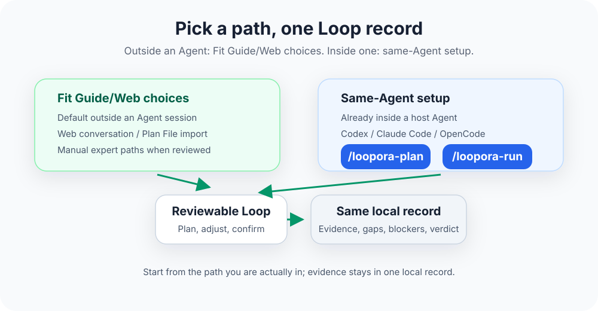

[简体中文](./README.zh-CN.md) | **English**

<p align="center">
  
</p>

<p align="center">
  <a href="https://www.python.org/">
    
  </a>
  <a href="https://fastapi.tiangolo.com/">
    
  </a>
  
  
  
</p>

# Loopora

**Turn `/goal`-style long tasks into Human-shaped Loops with evidence and verdicts.**

In Coding Agents, persistent-goal mechanisms like `/goal` feel natural: give the Agent an objective, it remembers it, keeps pursuing across turns. This works for clear goals, fast feedback—"fix this error," "keep cleaning this module," "get this test suite green."

The hard part of complex tasks isn't just "keep the Agent going." It's judging after each round: did it actually do the right thing? Is evidence sufficient? Is risk acceptable? Should the next round pivot? Can this close now?

Real production feedback, incident feedback, business quality feedback often appears long after the task finishes. By the time final feedback arrives, early drift has already been reinforced by subsequent work. **Bare goals keep the task moving, but easily turn results into blind boxes**—the run looks more complete, but core risks might never have been proven.

Loopora solves this layer: when final feedback is too slow, errors cascade, and evidence needs intermediate governance, first use `/loopora-plan` to turn the objective, completion criteria, fake-done patterns, evidence requirements, and blocking risks into a reviewable Loop plan. Then use `/loopora-run` to let the Agent execute continuously within that Loop.

Loopora reduces error accumulation, makes each round return to the same judgment, letting long tasks run more steadily and healthily.

Human-shaped Loop is not just the name of an essay. A candidate Loop cannot be only a task summary; each step should inherit these judgments, action boundaries, and evidence gaps.

To understand the philosophy behind this approach, read [Human-Shaped Loop](./HUMAN-SHAPED-LOOP.md).

<p align="center">
  
</p>

## From `/goal` To Loop

If you would normally write:

```text
/goal build the self-service refund flow until it is ready to ship
```

Loopora suggests splitting into two steps:

```text
/loopora-plan
/loopora-run
```

The difference isn't command length—it's the reviewable judgment structure added before the long run starts.

| With bare `/goal` | With Loopora |
| --- | --- |
| Goal is usually one sentence | Goal becomes completion criteria, fake-done patterns, evidence requirements, and blocking risks |
| Agent mainly keeps pursuing the objective | Each round carries task judgment, action boundaries, evidence gaps, output requirements |
| Process can look increasingly complete | Each round must report proven, weak evidence, unproven, blocking items, residual risk |
| Closure easily relies on Agent declaring done | Task verdict needs supporting evidence; missing required evidence blocks pass |
| Human needs to repeatedly return to correct drift | Human reviews Loop before run, inspects evidence during run, intervenes at key points |

Loopora doesn't reject `/goal`. It inherits `/goal`'s core intuition: long tasks should keep moving. But for high-risk, multi-round, evidence-sensitive work, before continuing, first define "how will we judge it actually done."

## When Loopora Replaces `/goal`

Loopora does not fit every task. Use cases, agile iteration, and automated tests fit systems where feedback can be compressed enough: build a small slice, run a test, know immediately if it's right. Loopora fits slow-feedback systems: final feedback too late, errors cascade, "looks done" doesn't mean "actually done."

| Situation | Recommendation |
| --- | --- |
| Goal is small, one Agent pass plus one human review enough | Use Agent or `/goal` directly, no need for Loopora |
| Stable tests, evaluation suites, proof scripts, or automated proof can directly judge | Prefer those hard checks first |
| Final feedback fast, errors won't cascade | Use cases or direct Agent fit better |
| Task needs multi-round execution, each round creates new evidence | Loopora starts adding value |
| Result may look done while core risk remains unproven | Strong fit for Loopora |
| You need to retain, review, reuse, or manage this judgment via Web | Strong fit for Loopora |

Typical examples: self-service refunds, billing permission refactors, cross-service payment callback issues—these tasks' real feedback appears after launch, after incidents, after compliance review.

A simple test: if you expect to return in round 2, 3, or N asking "is evidence sufficient, is risk acceptable, where should next round focus, can this close now"—don't just run a bare goal; compile that judgment into a Loop.

## Quick Start

Currently only source install. You need:

- Python 3.11+
- `uv`
- At least one Coding Agent: Codex, Claude Code, or OpenCode

From Loopora repository root:

```bash
uv tool install --editable .
```

If uv says tool directory not on `PATH`, run once:

```bash
uv tool update-shell
```

Then restart shell.

Next, switch to the project where the Agent will work and install the Loopora entry:

```bash
cd /path/to/your/project
loopora init codex
```

Claude Code and OpenCode also supported:

```bash
loopora init claude
loopora init opencode
```

To only check whether the project Agent entry is complete, still Loopora-managed, and not missing managed protocol files:

```bash
loopora init codex --check
```

You can also check the same entries from the Agent namespace:

```bash
loopora agent codex check --workdir "$PWD"
```

`--check` only diagnoses: it does not install, repair, or overwrite. Before install, a failing check means "not installed yet" and prints the install command; after install, failed checks mean the managed entry needs attention.

The Agent Runner capability contract is intentionally small:

- Execution stays with the current host Agent in its current workdir. Loopora owns managed project entries plus `.loopora/` state, and it does not change model/provider routing, permissions, approval mode, global config, skills/plugins, MCP setup, credentials, or environment secrets.
- Activation stays explicit through `/loopora-plan`, `/loopora-run`, or Loopora CLI commands. Host hooks, session-start events, status lines, remote controls, and task trackers are observation or control surfaces, not Loopora phase entries.
- Role handoff uses the host-native mechanism and never starts a nested Codex, Claude Code, or OpenCode CLI. Handoff stays path-based, and multi-role fan-out happens only when the reviewed Loop declares a parallel group.
- Task proof comes from submitted Loopora evidence refs and the task verdict. Approval, host memory, compact summaries, injected editor context, external tool output, hook logs, marketplace/registry state, symlinks, and session archives are hints until submitted as Loopora evidence.
- Packaging stays project-local and thin. Behavior comes from Loopora Core plus managed references; manifests and check commands detect drift; check/init are the explicit update paths; entry visibility is checked through adapter-specific project files and metadata, and some hosts may need a restart or new session to refresh discovery.
- Recovery trusts exact context binding first. When more than one context is possible, Loopora lists recoverable choices instead of guessing the newest host session or taking over historical sessions.

Use Web for run status and details.

Then return to Agent and use two-stage entries for the current task:

```text
/loopora-plan
/loopora-run
```

For first use, invoke `/loopora-plan` inside your Agent and describe the task plus key judgments:

```text
I need to build a refund request backend:
- page submission is not completion
- must prove admin permission and refund eligibility
- payment failure must be traceable and handoff-ready
- audit trail must reconstruct a refund
```

Loopora first uses the judgments already clear in the current Agent context. If key judgment is still missing, `/loopora-plan` asks one focused question or opens Web review to align instead of inventing it. Later, if you want to tighten evidence, repair the candidate plan, adjust role responsibilities, or improve the Loop from run results, continue using `/loopora-plan`. After the preview looks right, run `/loopora-run`; the current Agent enters multi-round execution under that Loop. Later intents such as "continue," "resume," or "patch evidence" also belong to the `/loopora-run` stage.

<p align="center">
  
</p>

## How `/loopora-plan` Plans

`/loopora-plan` does not start execution immediately. It enters the Loop planning stage: generate, revise, repair, or tighten a reviewable task plan. For first-use readers, think of it as the reusable Loop shape: it turns a long objective into judgment structure that every later run must carry. If run evidence shows evidence rules, verdict conditions, or role responsibilities are wrong, return to `/loopora-plan` or Web review instead of letting the run stage silently change the plan.

The plan must carry this task's judgment, not just a task summary. Important task objects, risks, and evidence expectations should enter the task contract, Agent responsibilities, and run flow.

This plan typically contains:

| Artifact | Purpose |
| --- | --- |
| Task contract | Clarifies goal, completion criteria, fake-done patterns, tradeoffs, blocking risks |
| Agent responsibilities | Clarifies what each round should focus on, avoid, deliver, verify |
| Execution strategy | Clarifies what next round should build, prove, repair, narrow, expand, defer |
| Run flow | Clarifies role order, when to inspect, where to return when evidence weak |
| Evidence rules | Clarifies which materials count as strong evidence, which are just self-report or weak |
| Verdict rules | Clarifies when to pass, block, continue, carry explicit residual risk |
| Web preview | Lets you review fit, risks, evidence expectations, responsibilities, closure conditions before run |

<p align="center">
  
</p>

The plan doesn't try to encode all human judgment. It only encodes the part that repeatedly affects this long task: what counts as done, what must be rejected, what evidence is sufficient, which gap comes next, when can task close.

At runtime, Loopora turns these reader-facing pieces into runnable plan: task contract, Agent responsibilities, step order, handoffs, evidence rules stay linked—so Loop can be reviewed before execution and audited after.

## How `/loopora-run` Advances

`/loopora-run` enters the Loop run stage: start, continue, resume, or patch evidence gaps. Agent remains the main executor: it reads code, edits files, runs checks, and explains results. When work needs role handoff, Loopora uses the current host Agent's native role entries instead of starting another nested Codex, Claude Code, or OpenCode CLI process. Loopora's capability contract keeps that boundary explicit: the current host Agent executes in its current workspace, while Loopora manages entries, context binding, role boundaries, evidence, and task verdicts. Loopora keeps each round tied back to the reviewed plan, required evidence, and verdict rules instead of letting the task continue only from chat memory or a bare goal. If you ask to change the judgment standard during this stage, Agent should stop and route you back to `/loopora-plan` or Web review.

If current Agent session has exact Loopora binding, `/loopora-run` can resume directly. If workdir has recoverable Loopora runs but current Agent session differs or multiple candidates exist, Loopora should surface choices—not guess which to continue. To create fresh Loop rather than reuse old judgment, return to `/loopora-plan` or Web and explicitly choose fresh start.

Common recovery paths follow user intent:

| Situation | What Loopora should do |
| --- | --- |
| `/loopora-plan` has no task context yet | It asks for task goal, fake-done risks, required evidence, and judgment tradeoffs before creating a preview |
| Current directory has no Loopora context yet | `/loopora-plan` creates a new candidate Loop by default |
| Current directory already has a spec, candidate Loop, run, or evidence | `/loopora-plan` surfaces available sources first; you can continue, improve, or explicitly start fresh |
| Work stopped halfway and you return to the same Agent session | `/loopora-run` resumes the same run through the exact binding and does not replan |
| You return from a different Agent session or several contexts are recoverable | `/loopora-run` surfaces choices with status and freshness hints; runnable choices show `next_loop_command` and `next_cli_command`, while non-runnable choices send you back to `/loopora-plan` or Web review |
| Previous run ended but evidence is still insufficient | `/loopora-run` starts the next round from the same Loop and focuses on unproven gaps |
| Previous task verdict already passed | `/loopora-run` replays the completed state and does not create an extra run |
| You explicitly want to recreate the plan | Use the fresh path in `/loopora-plan`; old runs and evidence stay history, not current judgment |
| Local Agent binding or context card is damaged | `/loopora-run` returns repair hints; run `loopora init <adapter> --check` first, then repair binding or use `/loopora-plan fresh` |
| Local file cleanup fails while deleting or replacing a plan file | Record deletion can still complete, but Loopora returns `cleanup_warnings` with path and error to clean manually |

A single run roughly follows:

1. Loopora finds reviewed candidate Loop.
2. Agent executes per current round's goal and boundaries.
3. Agent submits work output, checks, explanations, evidence references.
4. Loopora reconciles: what proven, what weak evidence, what remains unproven.
5. Blocking risk can't be packaged as completion.
6. Insufficient evidence pulls next round back to concrete gap.
7. When task can close, Loopora produces reviewable task verdict and residual-risk summary.

That's the difference between Loopora and ordinary prompt or bare `/goal`: prompt mainly shapes next answer; bare goal mainly keeps Agent moving; Loopora keeps same judgment active across multiple rounds.

## Evidence, Tests, and CI

Loopora does not replace tests, CI, or automated proof. Instead, judgments that can be written as tests should first become tests; boundaries that can be proven via proof scripts, schemas, lint, type checks, or real external probes should become strong evidence first.

Loopora handles the layer around that evidence: when evidence is missing, failing, incomplete, or only proves part of the task, the Agent can't package run completion as task completion.

| Evidence Shape | What it means in Loopora |
| --- | --- |
| Tests, CI, evaluation suites, proof scripts | Strongest machine evidence for stable contracts |
| Traceable artifacts, logs, screenshots, structured check results | Useful evidence, but must state what it proves |
| Independent checks or human review conclusions | Can help judgment, but not automatically hard proof |
| Agent's own summary | Readable explanation only; cannot support pass by itself |

If stable tests can fully judge the task, Loopora shouldn't make things heavier. Loopora fits long tasks that need tests and also need continuous judgment about evidence gaps, risk priority, and residual risk.

## Autonomy Boundary

Loopora aims to increase trusted autonomy, not unlimited authorization.

- It doesn't acquire new system permissions for Agent; what Agent can do still depends on host tool, workdir, local permissions.
- Loop's action strategy expresses whether current step is read-only, can write, or can issue final ruling.
- Within the same run, worktree writes should have clear boundaries; parallel review should not become several agents editing the same workspace area at once.
- Task verdict does not replace final human approval; it gives the human a reviewable evidence summary, blockers, and residual-risk notes.
- Local runs create evidence and artifacts; if task touches sensitive code, logs, or business data, handle per local project's security rules.

This boundary matters: Loopora's goal is not to make the Agent more eager to claim completion; it is to make completion harder to claim when proof is missing.

## What Web Can Do

Web is the fuller observation and management surface. You can start a Loop from Agent, or open Web anytime to inspect and manage. When started from Agent, `/loopora-plan` or `/loopora-run` returns a Web link, automatically starts or reuses the local Web service, and reports that status in CLI output.

Start local Web service manually:

```bash
loopora serve --host 127.0.0.1 --port 8742
```

Open [http://127.0.0.1:8742](http://127.0.0.1:8742).

Web fits these scenarios:

| Scenario | What you can see or do |
| --- | --- |
| Review candidate Loop | Inspect task contract, Agent responsibilities, execution strategy, run flow, evidence rules, verdict rules |
| Observe run | See where the Loop is, and what happened in the latest round |
| Inspect evidence | Separate proven, weak evidence, unproven, blockers, residual risk |
| Manage entries | Install or update Codex, Claude Code, OpenCode project entries |
| Adjust plans | Edit candidate plan when needed, or create Loop directly from Web |

Agent entry and Web entry are not separate worlds. Even if a Loop starts inside your Agent, it enters the same local records and can be viewed and managed in Web.
