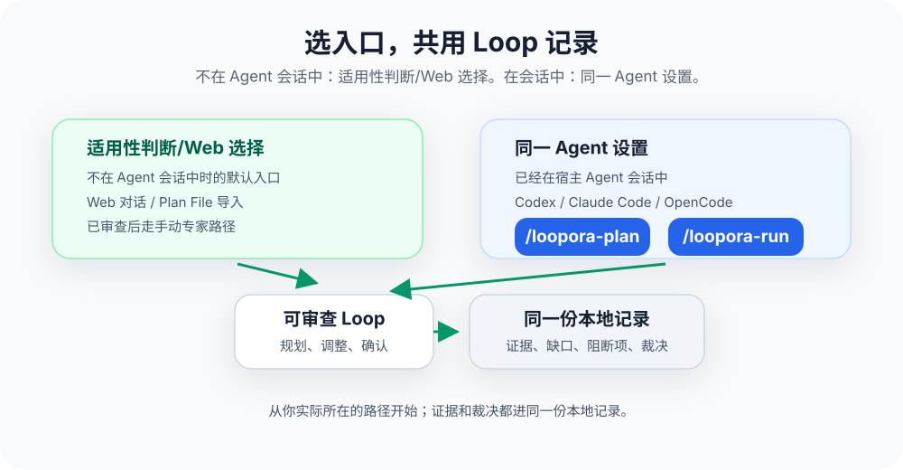

**简体中文** | [English](./README.md)

<p align="center">
  
</p>

<p align="center">
  <a href="https://www.python.org/">
    
  </a>
  <a href="https://fastapi.tiangolo.com/">
    
  </a>
  <a href="https://github.com/huyusong10/Loopora/actions/workflows/ci.yml?query=branch%3Adev">
    
  </a>
  <a href="https://github.com/huyusong10/Loopora/actions/workflows/codeql.yml?query=branch%3Adev">
    
  </a>
  
  
  
</p>

# Loopora

**把 `/goal` 式长期任务，变成带证据和裁决的 Human-shaped Loop。**

在 Coding Agent 里，`/goal` 这类持久目标机制很自然：你给一个目标，Agent 记住它，在后续回合里继续推进。它适合目标清楚、反馈快速的任务，比如"把这个报错修完""继续整理这个模块""把这批测试跑绿"。

问题在于，复杂任务的难点往往不只是"让 Agent 继续做"。更难的是每一轮之后判断：它是不是真的做对了？证据够不够？风险能不能接受？下一轮是否应该转向？现在能不能收尾？

真正的上线反馈、事故反馈、业务质量反馈，往往在任务跑完很久之后才出现。等最终反馈到来时，早期偏差已经被后续工作包装得更像完成。**裸目标可以让任务持续推进，却容易让结果变成开盲盒**——任务越跑越完整，但核心风险可能一直没被证明。

Loopora 解决的就是这层问题：当最终反馈太慢、错误会级联、证据需要中间治理时，先用 `/loopora-plan` 把目标、完成标准、伪完成模式、证据要求、阻断风险整理成一份可审查的 Loop 方案，再用 `/loopora-run` 让 Agent 在这个 Loop 里持续执行。

Loopora 负责降低误差累积速度，让每轮结果回到同一套判断，从而让长期任务更稳、更健康地运行下去。

Human-shaped Loop 不只是这篇文档的名字。候选 Loop 不能只是任务摘要；每一步都应继承这些判断、行动边界和证据缺口。

想理解这套方法背后的理念，建议阅读 [Human-Shaped Loop](./HUMAN-SHAPED-LOOP.zh-CN.md)。

<p align="center">
  
</p>

## 从 `/goal` 到 Loop

如果你原本会这样使用 `/goal`：

```text
/goal 把这个 React 组件库迁移成 Vue 版本，做到可以交付为止
```

Loopora 建议改为两步：

```text
/loopora-plan
/loopora-run
```

区别不在于命令更长，而在于运行前多了一层可审查的判断结构。

| 直接开 `/goal` | 换成 Loopora |
| --- | --- |
| 目标通常是一句话 | 目标被整理成完成标准、伪完成模式、证据要求和阻断风险 |
| Agent 沿着目标持续推进 | 每轮都带着任务判断、行动边界、证据缺口和输出要求 |
| 过程可能越来越像完成 | 每轮要说明已证明、弱证据、未证明、阻断项和残余风险 |
| 收尾容易依赖 Agent 自己说完成 | 任务裁决必须有支持证据；必需证据缺失时不能通过 |
| 人需要反复回来纠偏 | 人在运行前审查 Loop，运行中看证据，关键处再介入 |

Loopora 不否定 `/goal`。相反，它继承了 `/goal` 最核心的理念：长期任务应该由 Agent 持续推进。但对高风险、多轮、证据敏感的任务，持续推进之前应先明确"怎样判断它真的做对"。

## 什么时候用 Loopora 代替 `/goal`

Loopora 不适合所有任务。用例、敏捷迭代、自动化测试适合把反馈压缩得足够快的系统：做一个小切片，跑一次测试，立刻知道对错。Loopora 适合慢反馈系统：最终反馈太晚、错误会级联、看起来完成不等于真实完成。

| 场景 | 建议 |
| --- | --- |
| 目标很小，一次 Agent 执行加一次人工审阅即可 | 直接用 Agent 或 `/goal`，无需 Loopora |
| 已有稳定测试、基准评测或证明脚本可直接判定 | 优先使用这些硬性反馈 |
| 最终反馈快，错误不会级联 | 用例或直接 Agent 更合适 |
| 任务需要多轮执行，且每轮都会产生新证据 | Loopora 开始有价值 |
| 结果可能"看起来已完成"，但核心风险尚未证明 | 很适合 Loopora |
| 你需要保留、审查、复用或通过 Web 管理这套判断 | 很适合 Loopora |

典型示例：React 到 Vue 等价迁移、账单权限重构、跨服务支付回调问题、复杂数据迁移、生产基础设施变更。退款自助流程这类高风险业务任务也适合，但它不是理解 Loopora 的必要前提。

一个简单的判断标准：如果你预计自己会在第 2 轮、第 3 轮、第 N 轮反复问"证据够吗、风险能接受吗、下一步该补哪里、现在能不能收尾"，就不要只开一个裸目标，应该把这套判断编译成 Loop。

## 快速开始

当前仅支持源码安装。需要：

- Python 3.11+
- `uv`
- 至少一个 Coding Agent：Codex、Claude Code 或 OpenCode

在 Loopora 仓库根目录执行：

```bash
uv tool install --editable .
```

若 uv 提示工具目录不在 `PATH` 中，执行一次：

```bash
uv tool update-shell
```

然后重启 shell。

接着，切换到 Agent 将要工作的项目目录，安装 Loopora 入口：

```bash
cd /path/to/your/project
loopora init codex
```

Claude Code 与 OpenCode 也支持接入：

```bash
loopora init claude
loopora init opencode
```

如果只想检查项目里的 Agent 入口是否完整、是否仍由 Loopora 管理、是否缺少托管协议文件，可运行：

```bash
loopora init codex --check
```

也可以从 Agent 命名空间检查同一组入口：

```bash
loopora agent codex check --workdir "$PWD"
```

`--check` 只诊断，不安装、不修复、不覆盖文件。安装前检查失败表示“尚未安装”，并会给出安装命令；安装后检查失败才表示托管入口需要处理。

如果想一次性查看本地包、默认 Web 入口和所有支持的 Agent 入口是否具备首次使用条件，可运行：

```bash
loopora doctor --workdir "$PWD"
```

`doctor` 是只读检查。没有任何 Agent 入口就绪时会以非零退出码结束，并给出下一步安装/检查命令，而不是替你改文件。需要自动化读取时可加 `--json`。同一检查也可通过 `loopora diagnose doctor` 使用。

Agent 接入能力契约刻意保持很小：

- 执行主体仍是当前宿主 Agent，工作目录也来自当前宿主上下文。Loopora 只拥有托管项目入口和 `.loopora/` 状态，不改写模型选择、后端路由、权限、审批模式、全局配置、宿主技能/插件、外部工具配置、凭据或环境密钥。
- 激活必须显式来自 `/loopora-plan`、`/loopora-run` 或 Loopora CLI 命令。宿主钩子、会话开始事件、状态栏、远程控制面和外部任务看板都不是 Loopora 阶段入口。
- 角色交接走宿主原生机制，不嵌套启动另一套 Codex、Claude Code 或 OpenCode 命令行。交接内容保持路径化；只有已审查的 Loop 声明并行组时，才允许多角色扇出。
- 任务证明来自提交到 Loopora 的证据引用和任务裁决。审批、宿主记忆、压缩摘要、编辑器注入上下文、外部工具输出、钩子日志、市场/registry 状态、符号链接和会话归档都只是提示，除非被提交为 Loopora 证据。
- 包装保持项目本地且很薄。行为源来自 Loopora Core 和托管参考；清单与检查命令负责发现漂移；检查/初始化是显式更新路径；入口可见性通过适配器专属项目文件和元数据确认，某些宿主可能需要重启或新会话来刷新发现。
- 恢复时先信精确上下文绑定。存在多个可能上下文时，Loopora 会列出可恢复选择，而不是猜最新宿主会话或接管历史会话。

状态详情仍应通过 Web 查看。

然后回到 Agent，用两个阶段入口处理当前任务：

```text
/loopora-plan
/loopora-run
```

首次使用时，可在 Agent 中运行 `/loopora-plan`，然后描述任务和关键判断：

```text
我要做 React 到 Vue 的组件库迁移：
- Vue 项目能跑不算完成
- 必须证明核心组件、props、事件和状态行为与原 React 版本等价
- 只跑新写的干净 demo 不算强证据
- 未迁移项、弱证据项、越界新增 API 必须显式列出
```

Loopora 会优先使用当前 Agent 上下文里已经明确的判断。若关键判断还不足以决定 Loop 的结构，`/loopora-plan` 会先追问一个聚焦问题，或打开 Web 审查入口继续对齐，而不是替你编造判断。后续如果你要加严证据、修复候选方案、调整角色职责或根据运行结果改进 Loop，也继续使用 `/loopora-plan`。预览看起来正确后，运行 `/loopora-run`，当前 Agent 即进入该 Loop 下的多轮任务执行；之后说"继续""resume""补证据"这类意图，也都属于 `/loopora-run` 阶段。

<p align="center">
  
</p>

## `/loopora-plan` 如何规划

`/loopora-plan` 的目的不是立即执行，而是进入 Loop 的规划阶段：生成、修订、修复或加严一份可审查的任务方案。首次使用时，可将其理解为 Loop 的可复用形态：它把一句长期目标变成后续运行绕不开的判断结构。运行后若发现证据规则、裁决条件或职责分工不对，也应回到 `/loopora-plan` 或 Web review 调整，而不是让执行阶段偷偷改方案。

方案必须携带本任务的判断，而不只是任务摘要。重要任务对象、风险与证据预期应进入任务契约、Agent 职责与运行流程。

这份方案通常包含：

| 产物 | 作用 |
| --- | --- |
| 任务契约 | 明确目标、完成标准、伪完成模式、取舍与阻断风险 |
| Agent 职责 | 明确 Agent 每轮应关注什么、避免什么、交付什么、验证什么 |
| 执行策略 | 明确下一轮应构建、取证、修复、收窄、扩展还是暂缓什么 |
| 运行流程 | 明确角色顺序、何时检查、证据不足时回到哪里 |
| 证据规则 | 明确哪些材料算强证据，哪些只是自述或弱证据 |
| 裁决规则 | 明确何时通过、何时阻断、何时继续、何时留下残余风险 |
| Web 预览 | 让你在运行前审查适用性、风险、证据预期、角色责任和收尾条件 |

<p align="center">
  
</p>

方案文件并不试图涵盖人的全部判断能力。它只编码那些会在本次长期任务中反复影响结果的判断：什么算完成，什么必须拒绝，什么证据足够，下一轮应补哪里，何时可以收尾。

运行时，Loopora 会把这些面向读者的内容转成可执行方案：任务契约、Agent 职责、步骤顺序、交接和证据规则保持一致，因此 Loop 能在执行前被审查、执行后被复盘。

## `/loopora-run` 如何推进

`/loopora-run` 进入 Loop 的运行阶段：启动、继续、恢复或补齐证据。Agent 仍是主要执行者：读代码、改文件、运行检查、解释结果。需要分工时，Loopora 使用当前宿主 Agent 的原生角色入口，不再嵌套启动另一层 Codex、Claude Code 或 OpenCode 命令行进程。Loopora 的能力契约保持这条边界：当前宿主 Agent 执行，Loopora 只管理入口、上下文绑定、角色边界、证据和任务裁决。Loopora 负责让每轮工作回到已审查的方案、必要证据和裁决规则，而不是让任务仅凭聊天记忆或裸目标继续推进。若你在运行阶段提出的是"改判断标准"而不是"继续执行"，Agent 应停下来引导你回到 `/loopora-plan` 或 Web review。

如果当前 Agent 会话有精确的 Loopora 绑定，`/loopora-run` 可以直接恢复；如果同一运行目录里有可恢复的 Loopora 运行，但当前会话不同或存在多个候选，Loopora 应先展示选择，而不是猜测你要继续哪一个。若你想重新创建一份 Loop，而不是复用旧判断，应回到 `/loopora-plan` 或 Web，并明确选择重新开始。

常见异常路径应按用户意图处理：

| 场景 | Loopora 应如何处理 |
| --- | --- |
| `/loopora-plan` 还没有任务上下文 | 先要求补充任务目标、伪完成风险、必要证据和判断取舍，再创建预览 |
| 当前目录没有已有 Loopora 上下文 | `/loopora-plan` 默认创建新的候选 Loop |
| 当前目录已有 spec、候选 Loop、run 或证据 | `/loopora-plan` 先展示可用来源；你可以继续、改进，也可以明确重新开始 |
| 任务执行到一半中断，下次回到同一个 Agent 会话 | `/loopora-run` 用精确绑定恢复同一个 run，不重新规划 |
| 换了 Agent 会话或存在多个可恢复上下文 | `/loopora-run` 展示选择并给出状态与时间提示；可运行选择会显示 `next_loop_command` 与 `next_cli_command`，不可运行选择会引导你回到 `/loopora-plan` 或 Web review |
| 上一轮 run 已结束但证据不足 | `/loopora-run` 基于同一个 Loop 启动下一轮，聚焦未证明的缺口 |
| 上一轮任务裁决已通过 | `/loopora-run` 回放完成状态，不额外创建新 run |
| 你明确要求重新创建方案 | 使用 `/loopora-plan` 的重新开始路径；旧 run 与证据保留为历史，不被当作当前判断 |
| 本地 Agent 绑定或 context card 损坏 | `/loopora-run` 返回修复提示；先运行 `loopora init <adapter> --check` 诊断，再决定修复绑定或 `/loopora-plan fresh` |
| 删除或替换方案文件时本地文件清理失败 | 记录删除仍可完成，但 Loopora 会返回 `cleanup_warnings`，说明需要人工清理的路径和错误 |

单次运行大致遵循以下流程：

1. Loopora 找到已审查的候选 Loop。
2. Agent 根据当前轮次的目标和边界执行任务。
3. Agent 提交工作产物、检查结果、说明和证据引用。
4. Loopora 进行核对：哪些已证明，哪些只是弱证据，哪些仍未证明。
5. 存在阻断风险时，运行不能被包装为完成。
6. 证据不足时，下一轮将被拉回具体缺口。
7. 可以收尾时，Loopora 给出可审查的任务裁决与残余风险说明。

这就是 Loopora 与普通 prompt 或裸 `/goal` 的区别：prompt 主要影响下一次回答；裸目标主要让 Agent 继续推进；Loopora 让同一组判断在多轮任务中持续生效。

## 证据、测试与 CI 的关系

Loopora 不替代测试、CI 或基准评测。相反，能写成测试的判断，通常应该先写成测试；能用证明脚本、schema、lint、类型检查或真实外部探针证明的边界，也应优先成为强证据。

Loopora 负责的是另一层问题：当这些证据缺失、失败、覆盖不足，或只能证明一部分任务时，Agent 不能把运行完成包装成任务完成。

| 证据形态 | 在 Loopora 中的含义 |
| --- | --- |
| 测试、CI、基准评测、证明脚本 | 最强的机器证据，优先用于证明稳定契约 |
| 可追溯产物、日志、截图、结构化检查结果 | 可作为具体证据，但需要说明证明了什么 |
| 独立检查或人工审阅结论 | 可以帮助判断，但不能自动等同于硬证明 |
| Agent 自己的总结 | 只能作为说明，不能单独支撑通过 |

如果一个任务已经有稳定测试能完整裁决，Loopora 不应该把事情复杂化。Loopora 更适合那些既需要测试，又需要持续判断证据缺口、风险优先级和残余风险的长期任务。

## 自治边界

Loopora 想扩大的是可信自治度，不是无限授权。

- 它不替 Agent 获得新的系统权限；Agent 能做什么，仍取决于宿主工具、工作目录和本地权限。
- Loop 的行动策略会表达当前步骤是只读、可写，还是可以做出最终裁决。
- 同一运行中，写入工作区的行动应有明确边界；并行查看不应变成多人同时修改同一片工作区。
- 任务裁决不是替代人类最终批准，而是给人一个可审查的证据摘要、阻断项和残余风险说明。
- 本地运行会产生证据和产物；如果任务涉及敏感代码、日志或业务数据，应按本地项目的安全规则处理。

这条边界很重要：Loopora 的目标不是让 Agent 更敢于宣称完成，而是让它在没有证明时更难宣称完成。

## Web 能做什么

Web 是更完整的观察和管理界面。你可以从 Agent 中启动 Loop，也可以随时打开 Web 查看和管理。从 Agent 发起时，`/loopora-plan` 或 `/loopora-run` 返回 Web 链接会自动启动或复用本地 Web 服务，并在输出中说明状态。

手动启动本地 Web 服务：

```bash
loopora serve --host 127.0.0.1 --port 8742
```

打开 [http://127.0.0.1:8742](http://127.0.0.1:8742)。

Web 适合以下场景：

| 场景 | 可查看或操作的内容 |
| --- | --- |
| 审查候选 Loop | 查看任务契约、Agent 职责、执行策略、运行流程、证据规则与裁决规则 |
| 观察运行 | 查看当前 Loop 执行到何处、最近一轮发生了什么 |
| 查看证据 | 区分已证明、弱证据、未证明、阻断项与残余风险 |
| 管理入口 | 安装或更新 Codex、Claude Code、OpenCode 的项目级入口 |
| 调整方案 | 在需要时编辑候选方案，或从 Web 直接创建 Loop |

Agent 入口与 Web 入口并不冲突。即使 Loop 从 Agent 中生成，也会进入同一套本地记录，可在 Web 上查看和管理。

## 贡献与安全

提交改动前，请先阅读 [CONTRIBUTING.md](./CONTRIBUTING.md)，了解本地环境、质量门和 design/tests 边界。安全问题请按 [SECURITY.md](./SECURITY.md) 报告；不要在公开 issue 中发布漏洞细节、密钥、令牌、私有日志或敏感工作区路径。
